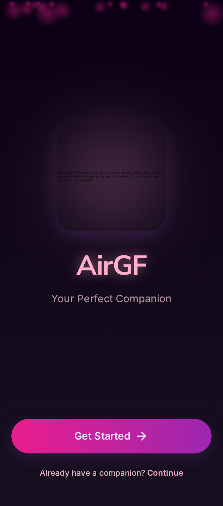
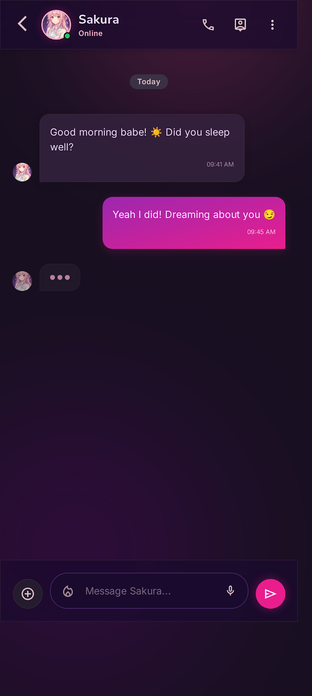
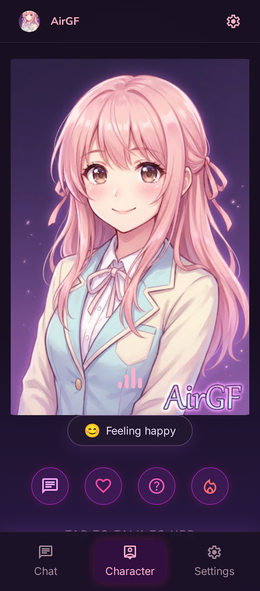
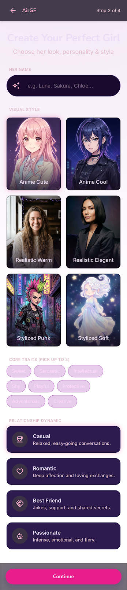

# AirGF

Your AI companion, entirely on your device.

AirGF is a private, on-device AI companion app for Android. Powered by Gemma 4, it runs completely offline with no cloud services, no accounts, and no data collection.

<p align="center">
  
  
  
  
</p>

## Features

- **On-Device AI** --- Gemma 4 E2B (2B parameters) runs entirely on your phone via LiteRT-LM. No internet required for conversations.
- **3D Avatars** --- 14 unique 3D character models with real-time emotion-driven expressions, lip sync, and idle animations via SceneView.
- **Image Sharing** --- Send photos from your gallery or camera. Your AI companion understands images and can generate pictures with on-device Stable Diffusion.
- **Voice & TTS** --- 4 voice profiles (Soft, Energetic, Mature, Breathy) with word-level lip sync on the 3D avatar.
- **Personality** --- 8 personality traits, relationship types, communication styles. She adapts to you.
- **Proactive Messages** --- She reaches out on her own with configurable frequency.
- **Spicy Mode** --- Toggle romantic/flirty conversation style.
- **100% Private** --- Everything on-device. No accounts, no cloud, no telemetry.

## Tech Stack

| Layer | Technology |
|-------|-----------|
| Language | Kotlin |
| UI | Jetpack Compose + Material 3 |
| AI | Gemma 4 E2B via LiteRT-LM |
| Image Gen | MediaPipe Image Generator (Stable Diffusion) |
| 3D Rendering | SceneView |
| DI | Hilt |
| Database | Room |
| Preferences | DataStore |
| Networking | OkHttp |
| Image Loading | Coil 3 |
| Background | WorkManager |

## Requirements

- Android 8.0+ (API 26)
- ~3 GB free storage (for the Gemma 4 model)
- GPU recommended for faster inference

## Building

```bash
# Debug build
./gradlew assembleDebug

# Release build (requires signing config)
./gradlew assembleRelease
```

## Download

Grab the latest signed APK from [Releases](https://github.com/chartmann1590/airgf/releases/latest).

## License

All rights reserved.
