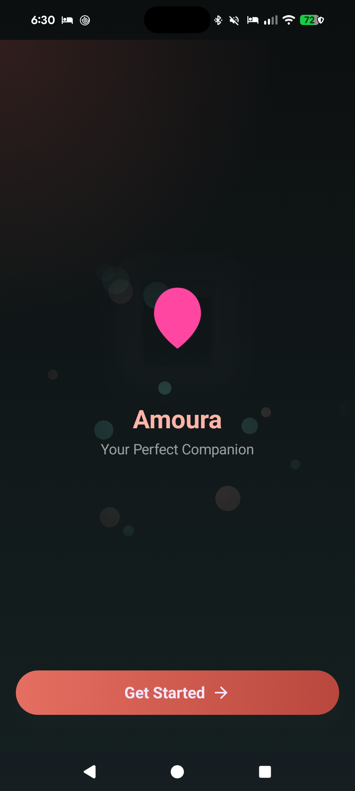
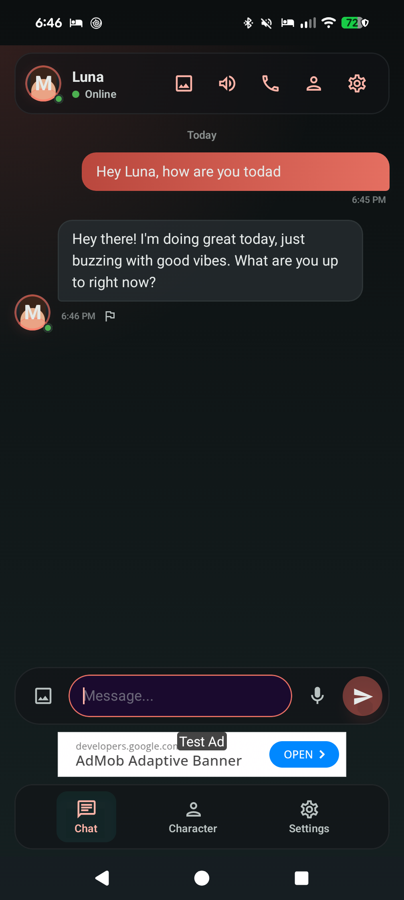
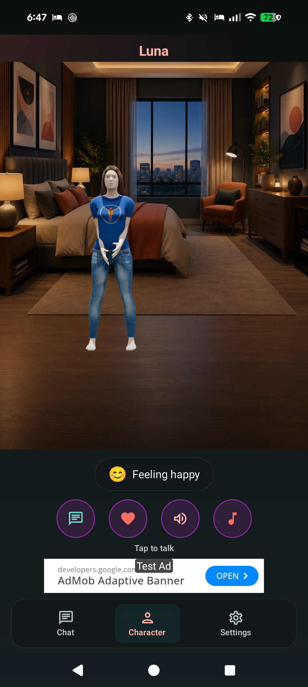
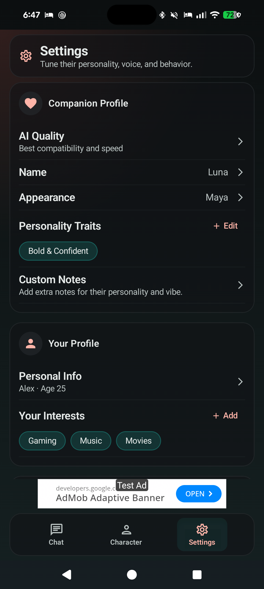

# Amoura

Your AI companion, entirely on your device.

Amoura is a private, on-device AI girlfriend/boyfriend companion app for Android. Powered by Gemma 4, conversations run completely offline on your phone — no cloud chat, no accounts required. The app is ad-supported, with an optional subscription for an ad-free, Spicy Mode experience.

<p align="center">
  
  
  
  
</p>

<p align="center">
  <a href="https://buymeacoffee.com/charleshartmann">
    
  </a>
</p>

## Features

- **On-Device AI** --- Gemma 4 E2B (2B parameters) runs entirely on your phone via LiteRT-LM. No internet required for conversations.
- **3D Avatars** --- 14 unique 3D character models with real-time emotion-driven expressions, lip sync, and idle animations via SceneView.
- **Image Sharing** --- Send photos from your gallery or camera. Your AI companion understands images and can generate pictures with on-device Stable Diffusion.
- **Voice & TTS** --- 4 voice profiles (Soft, Energetic, Mature, Breathy) with word-level lip sync on the 3D avatar.
- **Personality** --- 8 personality traits, relationship types, communication styles. Your companion adapts to you.
- **Proactive Messages** --- Your companion reaches out on their own with configurable frequency.
- **Spicy Mode** --- Romantic/flirty conversation style, off by default. Unlock it permanently with a subscription (also removes all ads), or temporarily by watching a rewarded ad (up to 4 hours/day).
- **100% Private Conversations** --- Chat, memory, and companion data stay entirely on-device. No accounts required.

## Tech Stack

| Layer | Technology |
|-------|-----------|
| Language | Kotlin |
| UI | Jetpack Compose + Material 3 |
| AI | Gemma 4 E2B via LiteRT-LM |
| Image Gen | MediaPipe Image Generator (Stable Diffusion) |
| 3D Rendering | SceneView |
| DI | Hilt |
| Database | Room |
| Preferences | DataStore |
| Networking | OkHttp |
| Image Loading | Coil 3 |
| Background | WorkManager |
| Ads | Google AdMob (banner, interstitial, rewarded) |
| Consent | Google User Messaging Platform (UMP) |
| Billing | Google Play Billing Library |

## Monetization

Amoura is free to use. Banner and interstitial ads support the app, and Spicy
Mode is gated behind a subscription or rewarded-ad credits:

- **Subscription** --- unlocks Spicy Mode permanently and removes all ads.
- **Rewarded ads** --- watching one grants 15 minutes of Spicy Mode, up to a
  4-hour/day cap, as a free alternative to subscribing.
- Ad personalization consent (EEA/UK/Switzerland) is managed via Google UMP
  and can be changed anytime from Settings → Privacy Options.

## Requirements

- Android 8.0+ (API 26)
- ~3 GB free storage (for the Gemma 4 model)
- GPU recommended for faster inference
- Internet connection for initial model download, ads, and subscription checks (conversations themselves run fully offline once set up)

## Building

```bash
# Debug build
./gradlew assembleDebug

# Release build (requires signing config)
./gradlew assembleRelease
```

## Download

Get it on [Google Play](https://play.google.com/store/apps/details?id=com.airgf.app), or grab the latest signed APK from [Releases](https://github.com/chartmann1590/airgf/releases/latest).

## Privacy

Conversations, memory, and companion data stay on-device. Ads (AdMob),
subscriptions (Google Play Billing), and optional crash/analytics reporting
involve third-party SDKs — see the full breakdown in
[`play-store/legal/README.md`](play-store/legal/README.md).

## Support this project

If Amoura is useful to you, consider supporting development:
[buymeacoffee.com/charleshartmann](https://buymeacoffee.com/charleshartmann)

## License

All rights reserved.
